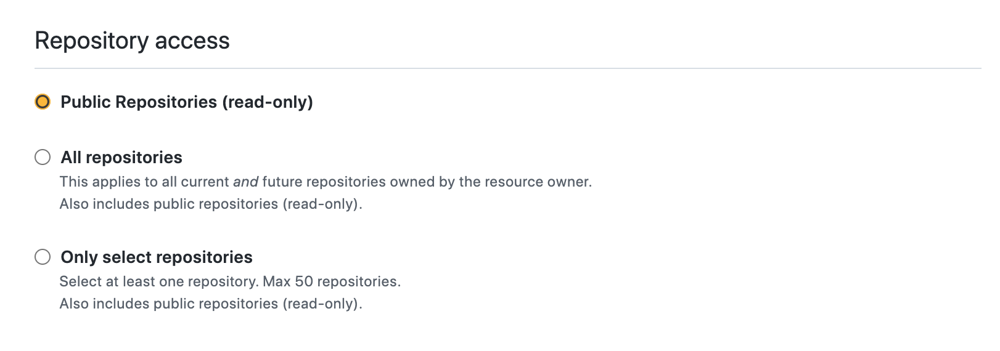

# Steampup
Steampup is a simple tool to query information about Github stars using natural language queries.

It uses [Steampipe](https://steampipe.io) to query Github stars via its Github plugin and 
[OpenAI](https://openai.com)'s GPT-3 API to generate SQL from natural language queries.

## Prerequisites

1. Create an OpenAI API key. [Create a free account](https://platform.openai.com/) and then [create your
   API key](https://platform.openai.com/docs/quickstart/build-your-application).
2. Create a fine grained Github Personal access token with read access to public repos.
   
3. Make sure you have docker installed and running along with docker-compose.

## Installation

1. Clone the repository
2. Make sure you have NodeJS installed (version 17 or higher)
3. Run `npm install` to install the dependencies
4. Run `npm run setup` and follow the prompts to configure and start the app

# Example requests

- `Last five people to star digio/istio-demo`
- `Everyone who starred both digio/istio-demo and digio/terraform-google-gitlab-runner`
